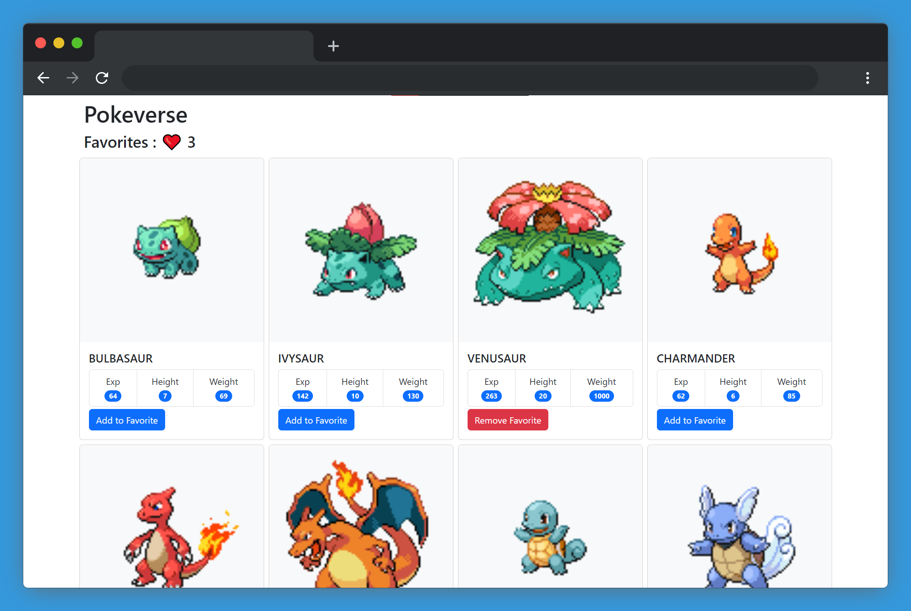

## 📋 Table of Contents
- [🌱 Pokemon Web App](#-pokemon-web-app)
  - [🌐 Live Demo](#-live-demo)
  - [📰 Article](#-article)
  - [⚙ Built With](#-built-with)
  - [🛠 Getting Started](#-getting-started)
    - [📦 Prerequisites](#-prerequisites)
    - [💾 Installation](#-installation)
    - [🚀 Deployment](#-deployment)
  - [📜 License](#-license)


# 🌱 Pokemon Web App
This is a simple dynamic website that displays info about Pokemons from API, built with React and Redux Toolkit. The goal of this project is to showcase the modern way of using Redux with React and how Redux Toolkit can make it easier to manage the state of an application.



## 🌐 Live Demo
You can visit the [live website here](https://indiecodermm.github.io/pokeverse/).

## 📰 Article
This project was created for my Medium article on *How to simplify Redux Logic with Redux Toolkit*. The article goes into detail on how to make asynchronous API calls and manage state with Redux Toolkit. If you're interested in learning more about this project, check out the article: 
- [How to Simplify Redux Logic with Redux Toolkit](https://hthant.medium.com/how-to-simplify-redux-logic-with-redux-toolkit-2f2b6db55a2b)

If you've read the article, I'd love to hear your feedback! 😃
Please feel free to leave your thoughts and suggestions in the comments.  

## ⚙ Built With
- [React.js](https://reactjs.org/) - JavaScript library for building user interfaces
- [Redux Toolkit](https://redux-toolkit.js.org/) - Batteries-included toolset for efficient Redux development
- [Poke API](https://pokeapi.co/) - Public API to fetch info about Pokemons
- [React Bootstrap](https://react-bootstrap.github.io/) - Bootstrap components for styling and layout

## 🛠 Getting Started
To get a local copy up and running, follow these steps.

### 📦 Prerequisites
- [Node.js](https://nodejs.org/en/) installed on your machine

### 💾 Installation
1. Clone this repo into your project folder
```sh
cd my-projects
git clone git@github.com:IndieCoderMM/pokeverse.git
```
2. Install the dependencies
```sh
cd pokeverse
npm install
```
3. Start the development server
```sh
npm start
```

### 🚀 Deployment
You can deploy this project using:
```sh
npm run build
```
This will create a production-ready build of your website in `build/` folder, which you can use to deploy on GitHub pages or any hosting platform.

**Deploying on GitHub Pages**

To deploy on GitHub pages, follow these steps.
1. Create a new GitHub repo and push your project.
2. Change the `homepage` url in `package.json` file.
```js
{
    ...
    "homepage": "https://[your_username].github.io/[your_repo_name]
}
```
3. After building the project with `npm run build`, deploy the `build/` folder.
```sh
npm run deploy
```
Your project will now be deployed to https://[username].github.io/[repo-name].

## 📜 License
This project is licensed under the MIT License - see the [LICENSE](./LICENSE) file for details.